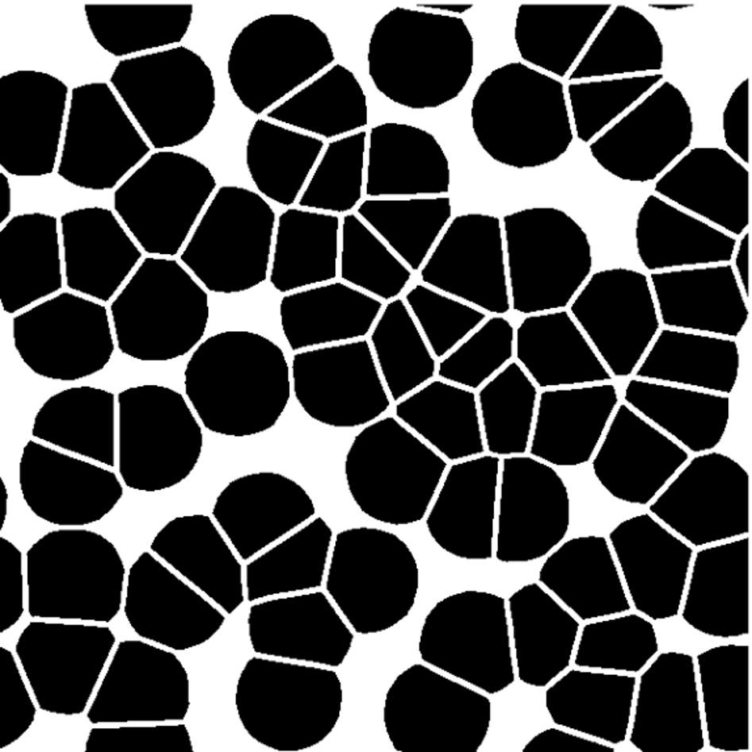
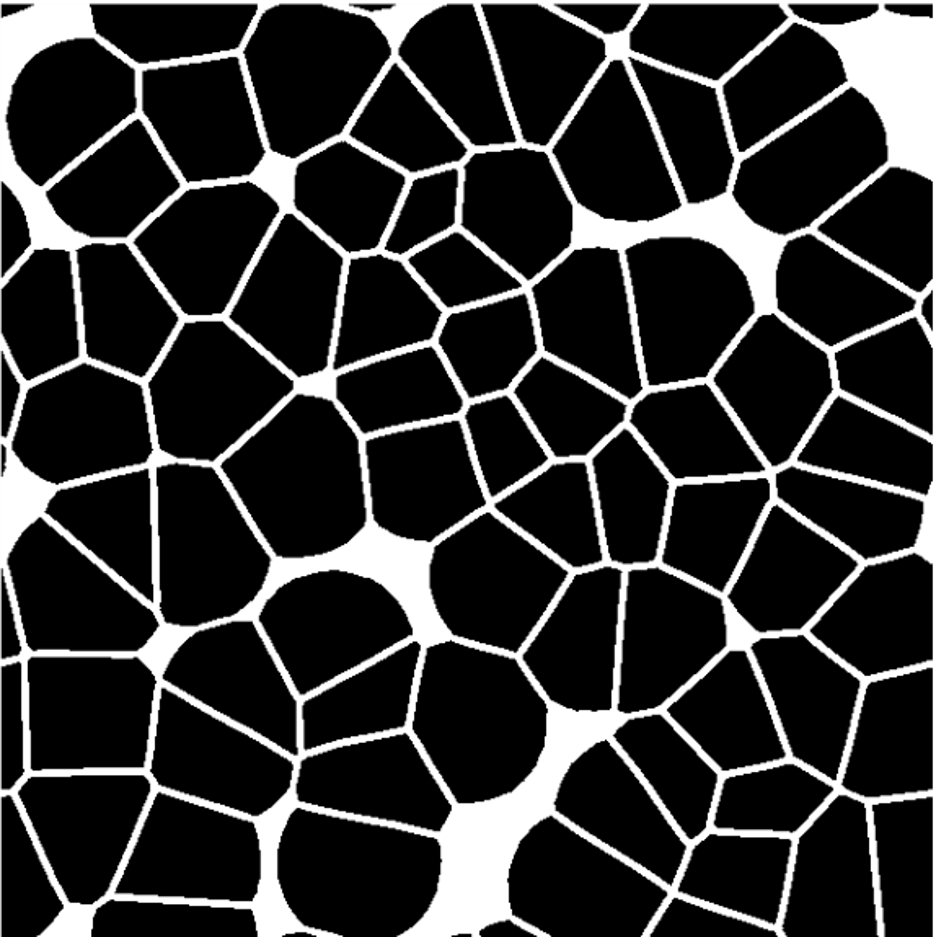

# ReX-Surrogate

## Abstract
From a materials engineering standpoint, the development and understanding of process-microstructure-properties relationships is crucial for the design of both processes and products. To this end, phase-field modeling is widely used to simulate the microstructural evolution at the mesoscale. As a result, linkages between the process and the microstructure are created, which can also expand towards the properties and performance of the respective material. However, besides its significant computational cost, phase-field modeling primarily deals with the forward problem of microstructural evolution prediction. For the inversion of the linkages, and towards the optimization of the process parameters that lead to desirable microstructures and properties, the approach has to change. Here, we create a surrogate (or reduced-order) model for the phase-field simulation of recrystallization of copper-nickel alloys. First, we simulate the phenomenon for several strategically defined points in the process parameter space of annealing temperature and duration. Thus, we obtain the final microstructures, which form the basis for the dataset that will be used for the training and evaluation of the machine learning surrogate model. We then use two-point spatial correlations to effectively quantify the ensemble of final microstructures and principal component analysis to derive their low-dimensional representations, which can now be used by a machine learning model. A Gaussian process regression model is trained by treating the process parameters as inputs and the final low-dimensional representations of the microstructures as outputs. By implementing this methodology, we develop easily accessible linkages between the process of annealing and the microstructures of these specific alloys, which can be expanded towards the properties and inverted through Bayesian optimization.

## Organization

├── AUTHORS.md              <- List of developers and maintainers.

├── CHANGELOG.md            <- Changelog to keep track of new features and fixes.

├── CONTRIBUTING.md         <- Guidelines for contributing to this project.

├── Dockerfile              <- Build a docker container with `docker build .`.

├── LICENSE.txt             <- License as chosen on the command-line.

├── README.md               <- The top-level README for developers

├── configs                 <- Directory for configurations of model & application.

├── data

│   ├── external            <- Data from third party sources.

│   ├── interim             <- Intermediate data that has been transformed.

│   ├── preprocessed        <- The final, canonical data sets for modeling.

│   └── raw                 <- The original, immutable data dump.

├── docs                    <- Directory for Sphinx documentation in rst or md.

├── environment.yml         <- The conda environment file for reproducibility.

## Sample Results

### Numerical and Analytical Solutions Comparison

Microstructures            |  Autocorrelations
:-------------------------:|:-------------------------:
  |  
  |  
### Strong Scaling

PCs for Microstructure Evolution             |  PCs for Microstructure Samples
:-------------------------:|:-------------------------:
  |  

Predictive Mean Surface for PC1             |  Predictive Mean Surface for PC2
:-------------------------:|:-------------------------:
  |  

####  To compile.
mpicc -O2 -std=c99 -o main.exe main.c functions.c -lm

####  To run.
mpiexec -n <number of processes> main.exe