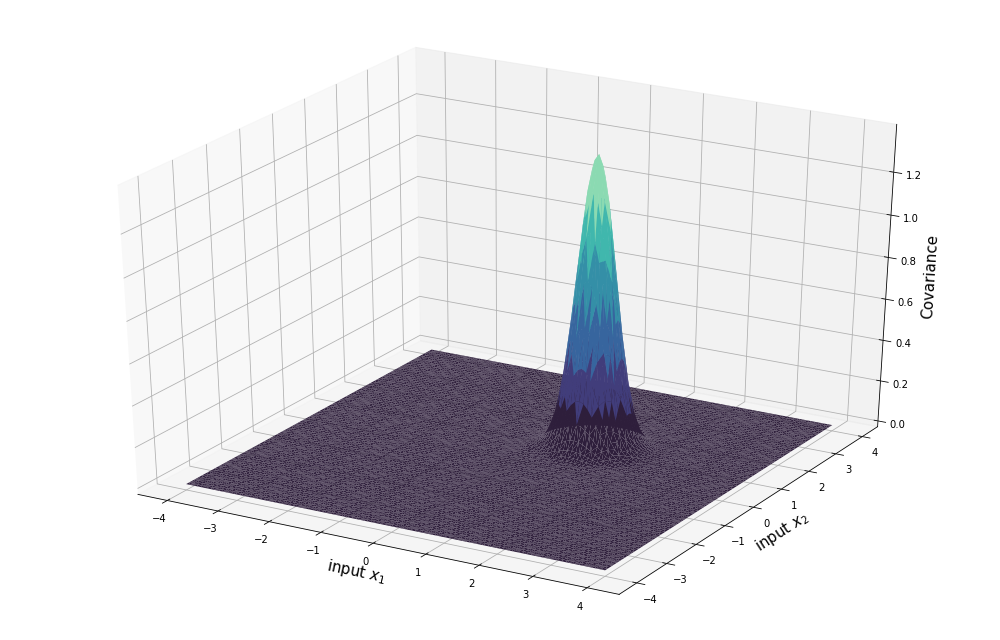

# ReX-Surrogate
<br/><br/>

<br/><br/>

## Abstract
From a materials engineering standpoint, the development and understanding of process-microstructure-properties relationships is crucial for the design of both processes and products. To this end, phase-field modeling is widely used to simulate the microstructural evolution at the mesoscale. As a result, linkages between the process and the microstructure are created, which can also expand towards the properties and performance of the respective material. However, besides its significant computational cost, phase-field modeling primarily deals with the forward problem of microstructural evolution prediction. For the inversion of the linkages, and towards the optimization of the process parameters that lead to desirable microstructures and properties, the approach has to change. Here, we create a surrogate (or reduced-order) model for the phase-field simulation of recrystallization of copper-nickel alloys. First, we simulate the phenomenon for several strategically defined points in the process parameter space of annealing temperature and duration. Thus, we obtain the final microstructures, which form the basis for the dataset that will be used for the training and evaluation of the machine learning surrogate model. We then use two-point spatial correlations to effectively quantify the ensemble of final microstructures and principal component analysis to derive their low-dimensional representations, which can now be used by a machine learning model. A Gaussian process regression model is trained by treating the process parameters as inputs and the final low-dimensional representations of the microstructures as outputs. By implementing this methodology, we develop easily accessible linkages between the process of annealing and the microstructures of these specific alloys, which can be expanded towards the properties and inverted through Bayesian optimization.

## Sample Results

PCs for Microstructure Evolution             |  PCs for Microstructure Samples
:-------------------------:|:-------------------------:
  |  

Optimized Kernel for PC1             |  Optimized Kernel for PC2
:-------------------------:|:-------------------------:
  |  

Predictive Mean Surface for PC1             |  Predictive Mean Surface for PC2
:-------------------------:|:-------------------------:
  |  

## Citations

### Influential Papers
```
@article{Molkeri2022,
  title = {On the importance of microstructure information in materials design: PSP vs PP},
  author = {Abhilash Molkeri and Danial Khatamsaz and Richard Couperthwaite and Jaylen James and Raymundo Arróyave and Douglas Allaire and Ankit Srivastava},
  journal = {Acta Materialia},
  year = {2022}
}

@inproceedings{Dingreville2021,
  title={Accelerating phase-field-based microstructure evolution predictions via surrogate models trained by machine learning methods},
  author={David Montes de Oca Zapiain and James A. Stewart and Rémi Dingreville},
  journal = {npj Computational Materials},
  year = {2021}
}

@article{Yabansu2019,
  title = {Application of Gaussian process regression models for capturing the evolution of microstructure statistics in aging of nickel-based superalloys},
  author = {Yuksel C. Yabansu and Almambet Iskakov and Anna Kapustina and Sudhir Rajagopalan and Surya R. Kalidindi},
  journal = {Acta Materialia},
  year = {2019}
}

@article{Bottger2015,
  title = {Multi-ternary extrapolation scheme for efficient coupling of thermodynamic data to a multi-phase-field model},
  author = {B. Böttger and J. Eiken and M. Apel},
  journal = {Computational Materials Science},
  year = {2015}
}
```

### Influential Books
```
@book{pml2Book,
  author = "Kevin P. Murphy",
  title = "Probabilistic Machine Learning: Advanced Topics",
  publisher = "MIT Press",
  year = 2023,
  url = "http://probml.github.io/book2"
}

@book{gramacy2020surrogates,
  title = {Surrogates: {G}aussian Process Modeling, Design and Optimization for the Applied Sciences},
  author = {Robert B. Gramacy},
  publisher = {Chapman Hall/CRC},
  address = {Boca Raton, Florida},
  note = {\url{http://bobby.gramacy.com/surrogates/}},
  year = {2020}
}

@book{Rasmussen2006,
  title = {Gaussian processes for machine learning.},
  author = {Rasmussen, Carl Edward and Williams, Christopher K. I.},
  publisher = {MIT Press},
  year = 2006
}
```
## Install dependencies via Anaconda

1. Clone and enter this repo: <br />
  `git clone https://github.com/jwwtc/ReX-Surrogate.git` <br />
  `cd ReX-Surrogate`
2. Install the requirements on a new Anaconda environment: `conda env create -f environment.yml`
3. Activate the environment: `conda activate rex-surrogate`

## License
This project is licensed under the [MIT License](https://github.com/jwwtc/ReX-Surrogate/blob/master/LICENSE).

### Acknowledgments

- [GPy](https://sheffieldml.github.io/GPy/) - a Gaussian Process (GP) framework
- [PyMKS](https://github.com/materialsinnovation/pymks) - Materials Knowledge System in Python
- [MICRESS](https://micress.rwth-aachen.de/) - the MICRostructure Evolution Simulation Software
